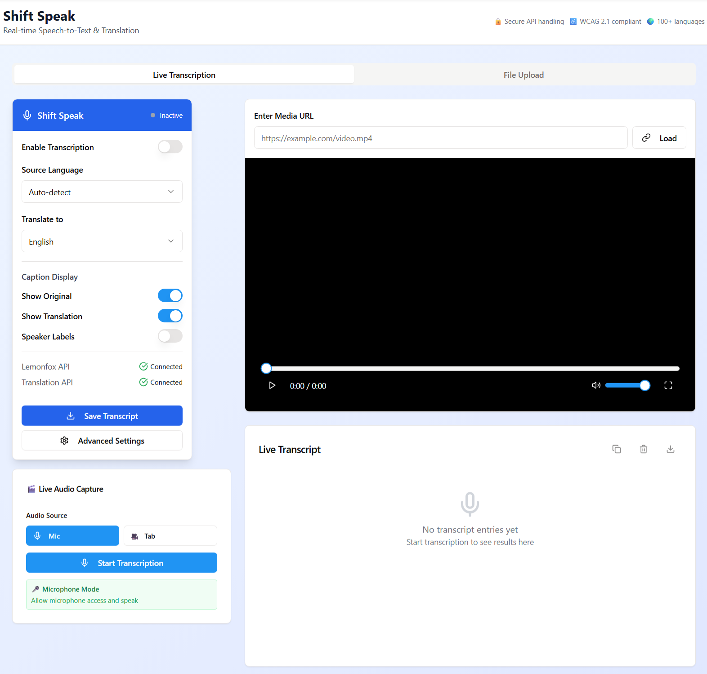
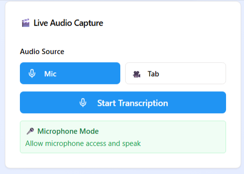
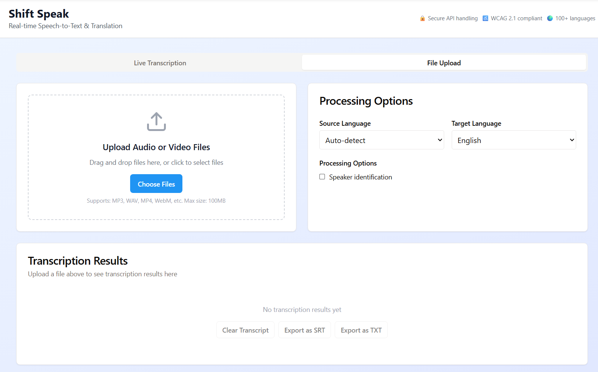
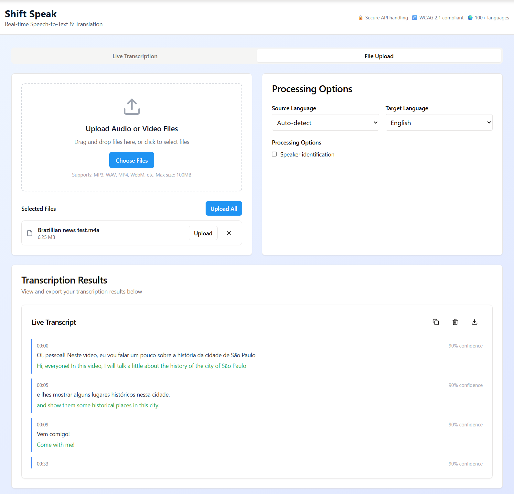

# Shift Speak 🗣️  
Real-Time Transcription & Translation for Any Audio or Video

Shift Speak is a real-time speech-to-text transcription and translation web app designed for accessibility. It enables users to transcribe live audio from their microphone or browser tab, or upload audio/video files for transcription and translation. The app displays live captions, allows language selection, and provides downloadable transcripts for later use. Future development includes full browser extension integration to caption any online content in real time.

## 🔧 Features

- Real-time transcription using Lemonfox API  
- Instant translation using OpenAI GPT-4o  
- Audio capture from microphone or browser tab  
- Upload audio or video files and view full transcript  
- Export transcripts as CSV or copy to clipboard  
- Live caption display via WebSocket  
- Status indicators, error handling, and audio-level monitoring  
- Responsive UI for desktop and mobile  
- Modular backend and extension-ready architecture  

## 🧠 How It Works

1. Choose your input source (microphone, browser tab, or file upload)  
2. Click to begin live transcription or upload a file  
3. Transcripts appear in real time or after processing  
4. Optionally translate content to a selected target language  
5. Download or copy transcripts when ready  

## 🖼️ Screenshots

| Home Screen | Audio Source Selection |
|-------------|------------------------|
|  |  |

| File Upload Panel | Transcription Output |
|-------------------|-----------------------|
|  |  |

## 🖥️ Tech Stack

**Frontend:**  
- React 18 (TypeScript)  
- Vite  
- shadcn/ui with Radix UI  
- Tailwind CSS  
- Wouter (routing)  
- React Query and local state  
- Zod (validation)  
- Uppy (file upload handling)  

**Backend:**  
- Express.js (TypeScript)  
- REST APIs and WebSocket server  
- LemonfoxTranscriptionService  
- OpenAITranslationService  
- PostgreSQL via Neon + Drizzle ORM  
- Google Cloud Storage (file handling)  

**Extension Architecture (In Progress):**  
- manifest.json (Manifest V3)  
- background.js, content.js, popup.html/js  
- Shared core modules reused from the web app  
- Universal caption renderer for overlays  

## 🗃️ Database Schema

- `users`: Stores login credentials and preferences  
- `sessions`: Tracks individual transcription sessions  
- `transcripts`: Stores individual segments with timestamps  
- `settings`: JSONB column for language and UI preferences  

## 🌐 External Services

- Lemonfox API – Speech-to-text engine  
- OpenAI GPT-4o – Translation model  
- Google Cloud Storage – Audio/video file uploads  
- Neon Database – PostgreSQL hosting  

## 🛡️ Security & Performance

- Helmet and secure headers  
- CORS configuration  
- Input validation with express-validator and Zod  
- Rate limiting and progressive slowdown  
- JWT-ready authentication system  
- In-memory caching for API results  
- Health check endpoints and metrics tracking  

## 🚀 Setup Instructions

**Prerequisites:**  
- Node.js 18+  
- PostgreSQL database (Neon recommended)  
- OpenAI and Lemonfox API keys  
- Google Cloud credentials (optional for file storage)  

**Environment Variables:**  
DATABASE_URL=your_postgres_connection_string  
OPENAI_API_KEY=your_openai_key  
PDL_API_KEY=your_people_data_labs_key  
SESSION_SECRET=your_session_secret_key  

**Install & Run Locally:**  
1. Clone the repository  
   git clone https://github.com/your-username/shift-speak.git  
   cd shift-speak  

2. Install dependencies  
   npm install  

3. Push the database schema  
   npm run db:push  

4. Start the development server  
   npm run dev  

5. Open in browser at:  
   http://localhost:5000  

## 🧩 Future Enhancements

- Fully deployed Chrome extension  
- Advanced speaker diarization and timestamps  
- Custom translation tone/style settings  
- Saved session playback with waveform view  
- Full user authentication and cloud sync  

## 📄 License

This project is licensed under the MIT License.

---

For support or contributions, please open an issue or submit a pull request.
